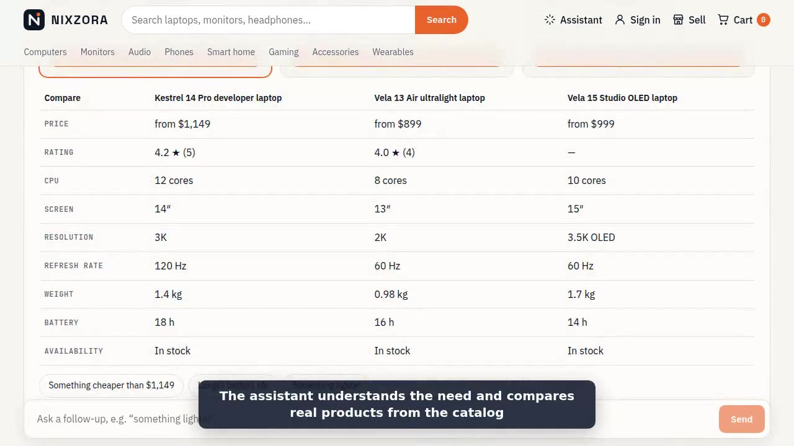

# NIXZORA

**AI-native commerce platform.** Shoppers describe what they need; NIXZORA finds it, explains it and builds the cart.

This repository is a monorepo for the web storefront, the iOS and Android app, the API, the Ops Center and the shared packages they use. It is built in public, phase by phase. Start with the **[case study](docs/case-study.md)**.



|                 |                                                                                                                                                     |
| --------------- | --------------------------------------------------------------------------------------------------------------------------------------------------- |
| **Status**      | Phase 8 · Scale and hardening: load-tested, fraud signals, security review, DR drill                                                                |
| **Departments** | Electronics, clothing & shoes, home & kitchen, beauty & personal care, sports & outdoors                                                            |
| **Shopping**    | Search suggestions and spec filters, delivery dates and tracking, reviews with photos, Q&A, price and stock alerts, smart picks, sponsored products |
| **Case study**  | [How NIXZORA was built, in numbers](docs/case-study.md) (with demo stills and video script)                                                         |

## Stack

| Layer          | Technology                                                                                                                              |
| -------------- | --------------------------------------------------------------------------------------------------------------------------------------- |
| Web storefront | Next.js 16, React 19, TypeScript                                                                                                        |
| Mobile app     | Expo SDK 57 (React Native 0.86), Expo Router, TanStack Query, Stripe PaymentSheet                                                       |
| API            | NestJS 11 modular monolith, REST + OpenAPI                                                                                              |
| Data           | PostgreSQL 16 with Prisma 7 and pgvector (read replica optional), Redis 7                                                               |
| AI             | Anthropic (assistant, summaries), Voyage (embeddings), free local drivers for development and CI                                        |
| Shared code    | Zod schemas (`@nixzora/validation`), shared types (`@nixzora/types`)                                                                    |
| Tooling        | pnpm workspaces, Turborepo, ESLint, Prettier, Jest, Playwright, k6, knip, GitHub Actions                                                |
| Platform       | AWS (ECS Fargate, RDS, ElastiCache, S3/CloudFront, WAF, SES) via Terraform; optional EKS + Helm and Kafka (MSK); Prometheus and Grafana |

Why it is shaped this way: [ADR-0001 Modular monolith first](docs/adr/0001-modular-monolith-first.md).

## Repository layout

```
nixzora/
├─ apps/
│  ├─ api/            NestJS API (port 4000). The same image also runs the search service,
│  │                  the AI service and the notifications worker (src/*-main.ts)
│  ├─ storefront/     Next.js store: shop, assistant, checkout, account, seller pages (port 3000)
│  ├─ admin/          Next.js Ops Center for staff (port 3001)
│  └─ mobile/         Expo app for iOS and Android (see its README)
├─ packages/
│  ├─ validation/     Zod schemas and shared rules, used by every app and the API
│  ├─ i18n/           English, French and Spanish messages and formatters
│  ├─ api-client/     Typed API client with token refresh (mobile app)
│  ├─ ui/             Brand tokens, logo, price (web apps)
│  ├─ types/          Shared TypeScript types
│  ├─ tsconfig/       Base TypeScript configs
│  └─ eslint-config/  Shared lint rules
├─ docs/              Case study, ADRs, architecture, runbooks, security, SLOs, reports
├─ infra/
│  ├─ terraform/      AWS (bootstrap, platform module, staging/production)
│  ├─ helm/           Kubernetes charts (optional EKS path, ADR-0021)
│  └─ observability/  Prometheus rules, Alertmanager, Grafana dashboards
├─ scripts/           Deploy and disaster-recovery scripts
├─ tests/load/        k6 load tests
├─ tools/             Demo image and video recorders
├─ docker-compose.yml PostgreSQL, Redis, and optional Jaeger, Prometheus, Grafana, Kafka
└─ .github/           CI, CodeQL, security scan, deploys, load test, mobile release
```

## Getting started

Requirements: Node.js 22.12 or newer, pnpm 10 (`corepack enable`), Docker Desktop.

```bash
# 1. Install dependencies
corepack enable
pnpm install

# 2. Configure environment (local development values only)
cp .env.example .env
cp .env.example apps/api/.env

# 3. Start PostgreSQL and Redis
pnpm db:up

# 4. Create the database tables (also seeds roles and permissions)
pnpm --filter @nixzora/api prisma:deploy

# 4b. Load demo catalog data: 14 categories, 10 fictional brands, 20 products
pnpm --filter @nixzora/api db:seed

# 4c. Create your first staff admin (prints a one-time temporary password)
pnpm --filter @nixzora/api admin:create you@example.com

# 5. Optional: stable signing keys so sign-ins survive API restarts.
#    Paste the three printed lines into apps/api/.env
pnpm --filter @nixzora/api keys:generate

# 6. Run the API, storefront and Ops Center together
pnpm dev
```

Then open:

- Storefront: http://localhost:3000 — browse the demo catalog and buy something. Payments run in test mode (no card) until you add Stripe test keys; receipts are printed in the API log.
- Ops Center: http://localhost:3001 — sign in with the admin you created; it walks you through two-step verification first.
- API health: http://localhost:4000/api/v1/health
- API docs (Swagger): http://localhost:4000/docs

## Common commands

| Command                                          | What it does                                                              |
| ------------------------------------------------ | ------------------------------------------------------------------------- |
| `pnpm dev`                                       | Run every app in watch mode                                               |
| `pnpm build`                                     | Build all packages and apps                                               |
| `pnpm lint` / `pnpm typecheck`                   | Static checks across the monorepo                                         |
| `pnpm test`                                      | Unit tests                                                                |
| `pnpm test:e2e`                                  | API end-to-end tests (needs `pnpm db:up`)                                 |
| `pnpm --filter @nixzora/storefront test:browser` | Browser test: a guest buys a product (needs `pnpm build` and seeded data) |
| `pnpm --filter @nixzora/mobile dev`              | Start the mobile app (Expo dev server; open it in a development build)    |
| `pnpm db:migrate`                                | Create and apply a new migration after editing `schema.prisma`            |
| `pnpm db:studio`                                 | Browse the database in Prisma Studio                                      |
| `pnpm obs:up`                                    | Start Jaeger for traces (http://localhost:16686)                          |
| `pnpm format`                                    | Format the codebase with Prettier                                         |

## What works today

- **Accounts**: sign-up, sign-in, email verification, forgot/reset/change password.
- **Sessions**: 15-minute EdDSA access tokens, rotating refresh tokens with theft detection, per-device sign-out.
- **Two-step verification**: authenticator apps (TOTP) plus 10 recovery codes; required for staff.
- **Roles and permissions**: customer, support, catalog manager, admin.
- **Audit log**: every security event, append-only, readable by admins at `GET /api/v1/admin/audit-logs`.
- **Protection**: per-IP rate limits, per-account lockout, security headers, strict config validation.
- **Catalog**: categories (tree), brands, products with variants, specs and images; public browse and search API (PostgreSQL full-text search with filters and sorting).
- **Inventory**: on-hand and reserved stock, checkout holds that can never oversell (row locks), expiring holds, audited adjustments.
- **Media**: one-time signed upload links, file-type checks on content, local disk in development and S3 in production.
- **Ops Center** (`apps/admin`): dashboard, products, categories and brands, inventory, users and roles, audit log, two-step setup and device sign-out. Tokens stay in HttpOnly cookies on the server.
- **Storefront**: home, departments, search with filters, product pages (with structured data for search engines), sitemap.
- **Cart**: guest carts in Redis, merged into the account cart at sign-in; prices always recomputed on the server.
- **Checkout**: US addresses, flat shipping (free over $99), state sales tax, stock held for 15 minutes, Stripe Payment Element (or test mode), signed and idempotent webhooks.
- **Orders**: confirmation and tracking pages, signed links for guests, order history and address book for customers, receipt/shipped/cancelled emails via the outbox, fulfillment (pack, ship with tracking, deliver, cancel with refund) in the Ops Center.
- **Operations**: partial refunds, customer returns (request → approve → receive → refund and restock), support notes on customers, review moderation, coupons, shipping labels (EasyPost, or printable test labels locally) and delivery tracking webhooks.
- **Shoppers**: product reviews with ratings, photos and helpful votes, questions and answers, wishlists, lists and shareable registries, price-drop and back-in-stock alerts, today's deals (lightning and day deals), Buy now, saved cards (kept by Stripe) with 1-click and a 30-minute cancel window, e-gift cards and a gift card balance, Subscribe & Save (5%, or 10% with 3+), private messages with stores, product comparison, delivery dates, search suggestions and spec filters, discount codes (try `WELCOME10` on orders over $50).
- **Sponsored products**: stores promote their listings next to matching searches, categories and products, paying per click from their earnings; smart picks from each shopper's own activity.
- **Deployment**: Docker images for each app, Terraform for AWS (ECS Fargate, RDS, ElastiCache, S3 + CloudFront, WAF, Secrets Manager, backups, alarms, SES), and a GitHub Actions pipeline with migrations, rolling deploys, automatic rollback and production approval.
- **Mobile app** (`apps/mobile`): browse, search, product pages, cart with promo codes, checkout with Stripe PaymentSheet (cards, Apple Pay, Google Pay), order history with a delivery timeline, saved products, barcode and QR scanning, push notifications for order updates, Face ID / fingerprint unlock, universal links, and a catalog that stays browsable offline.
- **Observability**: OpenTelemetry traces (optional Jaeger), JSON logs with trace ids.
- **AI shopping**: a shopping assistant that answers in plain words with grounded picks, semantic search on pgvector, recommendations and review insights (Anthropic and Voyage, or free local drivers).
- **Marketplace**: six-step seller onboarding, listing review, commission ledger and Stripe Connect payouts.
- **Scale and hardening**: search and AI services, notifications worker, optional Kafka and EKS, read replica, Prometheus/Grafana SLOs, k6 load tests, fraud signals, CSP and a pen-test checklist, scripted restore drills.

Try it in Swagger at http://localhost:4000/docs, or see [Authentication flows](docs/architecture/auth-flows.md). In development, emails (verification and reset links) are printed in the API log.

## Documentation

- **[Case study](docs/case-study.md)**: the problem, architecture, decisions, results and lessons
- [Authentication flows and endpoints](docs/architecture/auth-flows.md)
- [Checkout and payment flow](docs/architecture/checkout-flow.md)
- [Mobile app architecture](docs/architecture/mobile.md) and [mobile release runbook](docs/runbooks/mobile-release.md)
- [Deployment architecture](docs/architecture/deployment.md) and runbooks: [first deploy](docs/runbooks/first-deploy.md) · [deploy and roll back](docs/runbooks/deploy-and-rollback.md) · [restore the database](docs/runbooks/restore-database.md) · [disaster recovery](docs/runbooks/disaster-recovery.md) · [incident response](docs/runbooks/incident-response.md) · [rotate secrets](docs/runbooks/rotate-secrets.md) · [fraud review](docs/runbooks/fraud-review.md) · [email deliverability](docs/runbooks/email-deliverability.md) · [all runbooks](docs/runbooks/)
- [Data model (ERD)](docs/architecture/erd.md)
- [Service level objectives](docs/slo.md) · [load testing](docs/performance/load-testing.md) and the [October 2026 report](docs/performance/load-test-report-2026-10.md)
- [Shopping assistant evaluation](docs/evaluation/assistant.md)
- [Threat model](docs/security/threat-model.md) · [pen-test checklist](docs/security/pentest-checklist.md)
- [Technical debt register](docs/tech-debt.md)
- Decisions: [0001 Start as a modular monolith](docs/adr/0001-modular-monolith-first.md) · [0002 Authentication and sessions](docs/adr/0002-authentication.md) · [0003 Stripe behind a payment-provider interface](docs/adr/0003-payments-provider-interface.md) · [0004 Toolchain versions and data access](docs/adr/0004-toolchain-and-data-access.md) · [0005 Product media storage and catalog search](docs/adr/0005-media-storage-and-search.md) · [0006 Cart, checkout and order lifecycle](docs/adr/0006-cart-and-checkout.md) · [0007 Hosting on AWS with ECS Fargate](docs/adr/0007-aws-hosting.md) · [0008 Mobile app with Expo (React Native)](docs/adr/0008-mobile-app.md) · [0009 AI layer](docs/adr/0009-ai-layer-and-semantic-search.md) · [0010 Recommendations from the search index](docs/adr/0010-recommendations.md) · [0011 Review insights and product copy suggestions](docs/adr/0011-review-insights-and-product-copy.md) · [0012 Marketplace sellers](docs/adr/0012-marketplace-sellers.md) · [0013 Marketplace orders](docs/adr/0013-marketplace-orders-and-earnings.md) · [0014 Seller payouts](docs/adr/0014-seller-payouts.md) · [0015 Extract search into its own service](docs/adr/0015-search-service.md) · [0016 An AI service in front of the model providers](docs/adr/0016-ai-service.md) · [0017 A notifications worker for the background jobs](docs/adr/0017-notifications-worker.md) · [0018 Seller onboarding in six steps](docs/adr/0018-seller-onboarding.md) · [0019 Passkeys on the web](docs/adr/0019-passkeys-and-biometric-sign-in.md) · [0020 Event streaming with Kafka (Amazon MSK)](docs/adr/0020-event-streaming-kafka.md) · [0021 Kubernetes on EKS (Auto Mode) with a Helm chart](docs/adr/0021-kubernetes-eks-helm.md) · [0022 Read replica for catalog reads; monthly partitions for the event tables](docs/adr/0022-read-replica-and-partitioning.md) · [0023 Prometheus metrics](docs/adr/0023-prometheus-grafana-slos.md) · [0024 Fraud signals on checkout and payouts](docs/adr/0024-fraud-signals.md) · [0025 Upload scanning and re-encoding](docs/adr/0025-upload-scanning-and-re-encoding.md) · [0026 Carrier-verified seller shipments](docs/adr/0026-carrier-verified-seller-shipments.md) · [0027 On-call paging and a public status page](docs/adr/0027-on-call-and-status-page.md) · [0028 Sponsored products and smart picks](docs/adr/0028-sponsored-products-and-smart-picks.md) · [0029 Search help, delivery dates, reviews with photos, Q&A and alerts](docs/adr/0029-search-help-delivery-community-alerts.md) · [0030 Deals, lists and registries, and Buy now](docs/adr/0030-deals-lists-buy-now.md) · [0031 Saved cards, 1-click and cancelling a just-placed order](docs/adr/0031-saved-cards-and-1-click.md) · [0032 E-gift cards and the gift card balance](docs/adr/0032-gift-cards.md) · [0033 Subscribe & Save](docs/adr/0033-subscribe-and-save.md) · [0034 Messages between customers and stores](docs/adr/0034-customer-store-messages.md) · [0035 Compare products](docs/adr/0035-compare-products.md) · [0036 Search by photo](docs/adr/0036-search-by-photo.md) · [0037 NIXZORA Plus membership](docs/adr/0037-nixzora-plus.md) · [0038 Bundle & save](docs/adr/0038-bundle-and-save.md)

## Roadmap

| Phase                      | Dates                | Outcome                                                                     |
| -------------------------- | -------------------- | --------------------------------------------------------------------------- |
| P0 Blueprint and setup     | Oct 5 – 18, 2026     | Monorepo, ERD, ADRs, CI, end-to-end hello world                             |
| P1 Platform foundation     | Oct 19 – Nov 15      | Auth, MFA, sessions, RBAC, audit log                                        |
| P2 Catalog and admin core  | Nov 16 – Dec 13      | Catalog, inventory, Ops Center basics                                       |
| P3 Storefront and checkout | Jan 4 – Feb 14, 2027 | **v0.1** first purchase                                                     |
| P4 Operations and launch   | Feb 15 – Mar 14      | **v0.5** public demo on AWS                                                 |
| P5 Mobile app              | Mar 15 – Apr 18      | iOS and Android test builds                                                 |
| P6 Intelligence layer      | Apr 19 – May 30      | **v1.0** AI shopping assistant                                              |
| P7 Marketplace             | May 31 – Jul 11      | **v1.5** third-party sellers                                                |
| P8 Scale and hardening     | Jul 12 – Aug 22      | **v2.0** event-driven, load-tested                                          |
| P9 Launch readiness        | Aug 23 – Oct 3       | **v2.5** production open ([plan](docs/roadmap/phase-9-launch-readiness.md)) |

## Security

See [SECURITY.md](SECURITY.md). Never commit `.env` files or real credentials.
