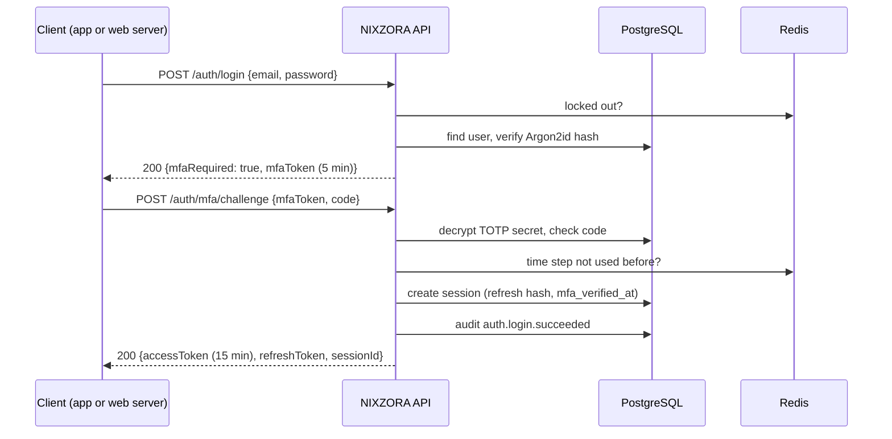
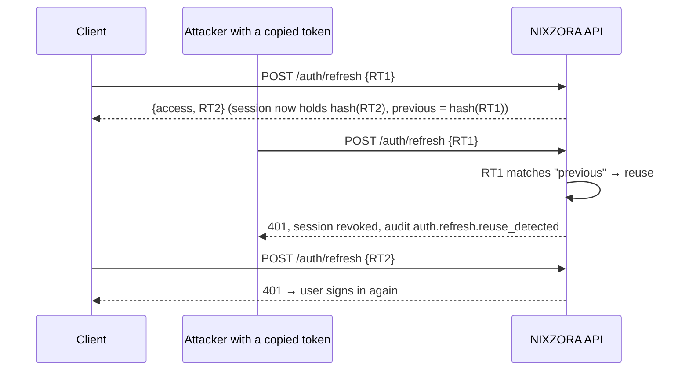

# Authentication flows

Design decisions: [ADR-0002](../adr/0002-authentication.md). Endpoints are documented live at `http://localhost:4000/docs` (development only).

## Endpoints

| Method | Path                               | Who                  | Purpose                                                   |
| ------ | ---------------------------------- | -------------------- | --------------------------------------------------------- |
| POST   | `/api/v1/auth/register`            | public · 5/min       | Create a customer account and sign in                     |
| POST   | `/api/v1/auth/login`               | public · 10/min      | Password step; returns tokens or an MFA challenge         |
| POST   | `/api/v1/auth/mfa/challenge`       | public · 10/min      | Exchange the challenge + TOTP or recovery code for tokens |
| POST   | `/api/v1/auth/refresh`             | public · 30/min      | Rotate the refresh token, get a new access token          |
| POST   | `/api/v1/auth/logout`              | signed in            | End this session                                          |
| GET    | `/api/v1/auth/me`                  | signed in            | Profile, roles and permissions                            |
| POST   | `/api/v1/auth/email/verify`        | public               | Confirm an email with the emailed token                   |
| POST   | `/api/v1/auth/email/verify/resend` | signed in · 5/min    | Send a new verification email                             |
| POST   | `/api/v1/auth/password/forgot`     | public · 5/min       | Email a reset link (same answer for unknown emails)       |
| POST   | `/api/v1/auth/password/reset`      | public · 5/min       | Set a new password; signs out every device                |
| POST   | `/api/v1/auth/password/change`     | signed in · 5/min    | Change password; signs out other devices                  |
| GET    | `/api/v1/me/sessions`              | `account.manage.own` | Signed-in devices                                         |
| DELETE | `/api/v1/me/sessions/:id`          | `account.manage.own` | Sign out one device                                       |
| DELETE | `/api/v1/me/sessions`              | `account.manage.own` | Sign out every other device                               |
| POST   | `/api/v1/me/mfa/setup`             | `account.manage.own` | Start two-step verification (secret + otpauth URL)        |
| POST   | `/api/v1/me/mfa/enable`            | `account.manage.own` | Confirm with a code; returns 10 recovery codes once       |
| POST   | `/api/v1/me/mfa/disable`           | `account.manage.own` | Turn off with a code                                      |
| GET    | `/api/v1/admin/audit-logs`         | `audit.read` + MFA   | Paginated audit history                                   |

## Sign-in with two-step verification

## Refresh-token rotation and theft detection

