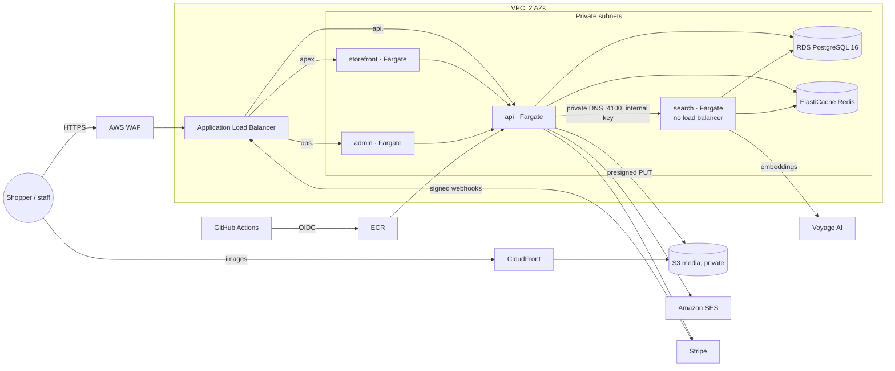

# Deployment architecture

- Infrastructure code: `infra/terraform` (`bootstrap/` once per account, `modules/platform/` per
  environment, `environments/{staging,production}/` roots). CI runs `fmt`, `validate` and
  `terraform test`, which plans both environments against mocked AWS.
- The search service ([ADR-0015](../adr/0015-search-service.md)) is the API image started with
  `dist/search-main.js`, found through Cloud Map DNS; remove `search` from `services` to run
  search inside the API again.
- Release pipeline: `.github/workflows/deploy.yml` → `deploy-environment.yml` →
  `scripts/deploy/{migrate,roll-out,smoke-test}.sh`.
- Runbooks: [first deploy](../runbooks/first-deploy.md) · [deploy and roll back](../runbooks/deploy-and-rollback.md) ·
  [restore the database](../runbooks/restore-database.md) · [incident response](../runbooks/incident-response.md) ·
  [rotate secrets](../runbooks/rotate-secrets.md)
