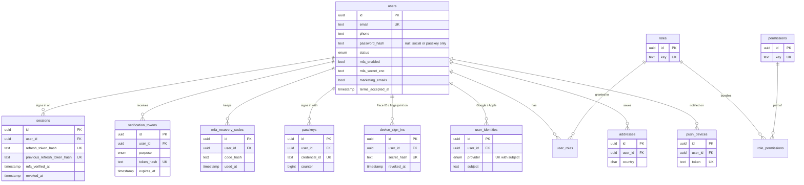
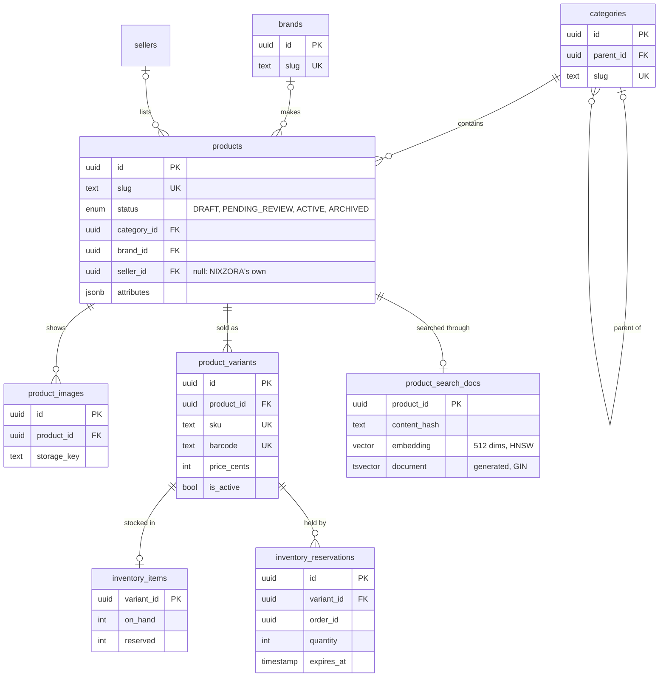
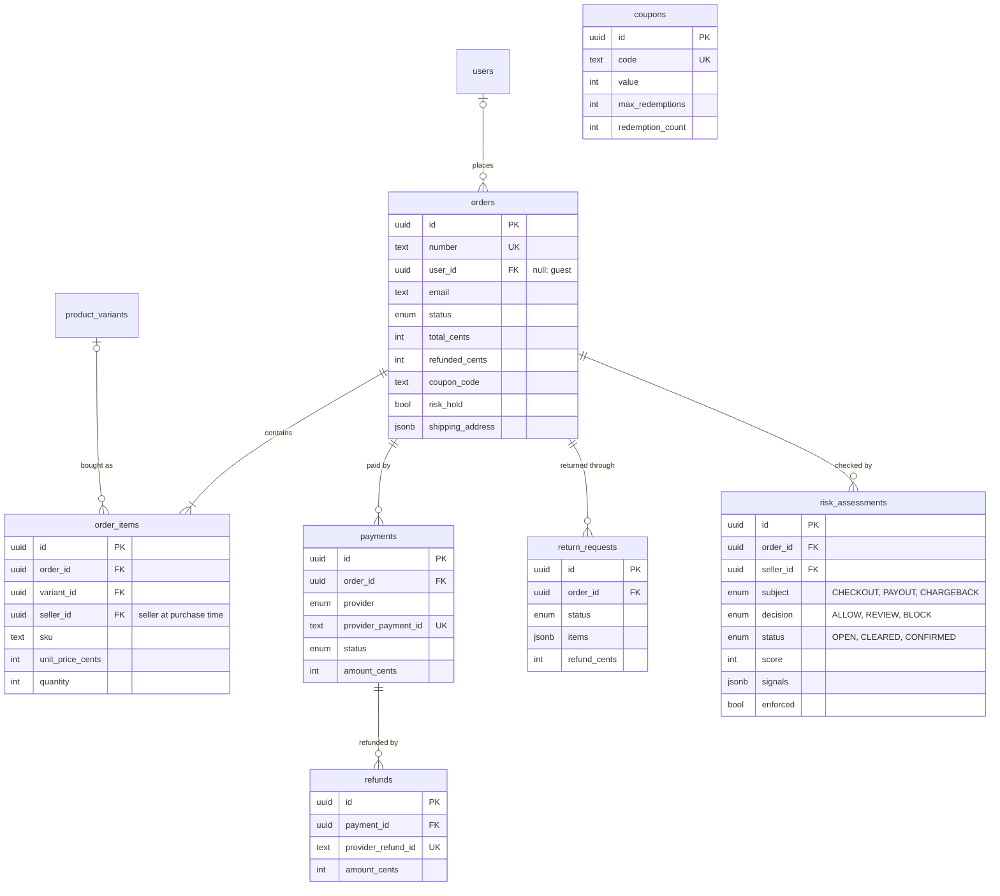
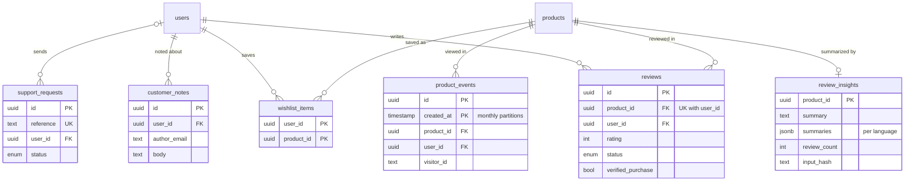
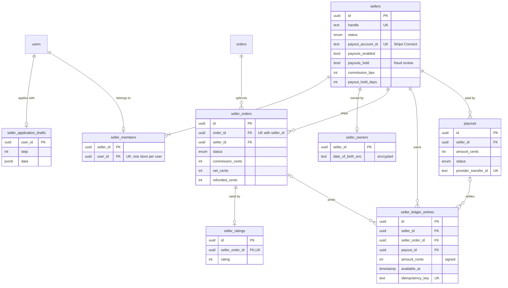

# NIXZORA data model (ERD)

Source of truth: [`apps/api/prisma/schema.prisma`](../../apps/api/prisma/schema.prisma) and the SQL
migrations next to it. 46 tables in PostgreSQL 16, as of Phase 8. The diagrams are split by area;
each shows the tables of that area and the columns that matter for relations and rules (not every
column).

## Identity and access

## Catalog and inventory

## Orders, payments and returns

`coupons` has no foreign key to orders: an order keeps the code it used (`orders.coupon_code`),
and the redemption count is raised in the same transaction as the order.

## Customers, reviews and AI

## Marketplace

## Platform tables (no foreign keys by design)

| Table                      | Purpose                                                                                                                                      |
| -------------------------- | -------------------------------------------------------------------------------------------------------------------------------------------- |
| `audit_logs`               | Append-only record of security and business events. UPDATE, DELETE and TRUNCATE are blocked by a trigger. Monthly partitions.                |
| `outbox_events`            | Transactional outbox. Rows are written with the change they describe and published by the worker (and to Kafka when on). Monthly partitions. |
| `processed_webhook_events` | Webhook idempotency: each provider event id is handled once.                                                                                 |
| `ai_requests`              | Every model call: feature, driver, tokens, estimated cost, latency, grounding. Feeds the AI panel and the daily cap.                         |

`audit_logs`, `outbox_events` and `product_events` are partitioned by month on `created_at`
([ADR-0022](../adr/0022-read-replica-and-partitioning.md)); their primary key is
`(id, created_at)`, the partitions live in the `partitions` schema, and old ones are dropped by
the retention job.

## Rules

- Money is stored in integer cents with a currency code. Seller money moves only through
  `seller_ledger_entries` (append-only, signed amounts, idempotency key per event); a payout
  settles the entries it covers ([ADR-0013](../adr/0013-marketplace-orders-and-earnings.md),
  [ADR-0014](../adr/0014-seller-payouts.md)).
- `available = inventory_items.on_hand - inventory_items.reserved`; reservations expire if
  checkout is abandoned. Every stock change locks the rows in id order.
- Orders keep snapshots (titles, SKUs, prices, seller, addresses) so history never changes when
  the catalog does.
- No card data is ever stored; `payments.provider_payment_id` points to the Stripe PaymentIntent.
  Seller bank details stay in Stripe Connect; a seller owner's date of birth is encrypted.
- Ids are UUID v7 (time-ordered, so new rows land at the end of each index).
- Personal data: deleting an account erases or anonymizes it; orders stay for tax and refund
  records but no longer point to a person. Allowed-checkout risk records are deleted after 90
  days.
