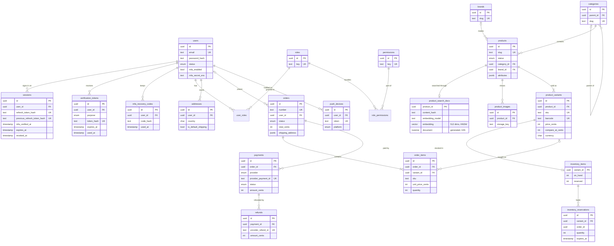

# NIXZORA data model (ERD)

Source of truth: [`apps/api/prisma/schema.prisma`](../../apps/api/prisma/schema.prisma). This diagram covers the core tables of Phases 1–5. Phase 4 added reviews, wishlist items, coupons, customer notes and return requests (see the schema); sellers arrive in Phase 7.

## Platform tables (no foreign keys by design)

| Table                      | Purpose                                                                                                              |
| -------------------------- | -------------------------------------------------------------------------------------------------------------------- |
| `audit_logs`               | Append-only record of security and business events. UPDATE, DELETE and TRUNCATE are blocked by a trigger.            |
| `outbox_events`            | Transactional outbox. Rows are written with the change they describe and published by a worker.                      |
| `processed_webhook_events` | Payment webhook idempotency: each provider event id is handled once.                                                 |
| `ai_requests`              | Every model call: feature, driver, tokens, estimated cost, latency, grounding. Feeds the AI panel and the daily cap. |

## Rules

- Money is stored in integer cents with a currency code.
- `available = inventory_items.on_hand - inventory_items.reserved`; reservations expire if checkout is abandoned.
- Orders keep snapshots (titles, SKUs, prices, addresses) so history never changes when the catalog does.
- No card data is ever stored; `payments.provider_payment_id` points to the Stripe PaymentIntent.
