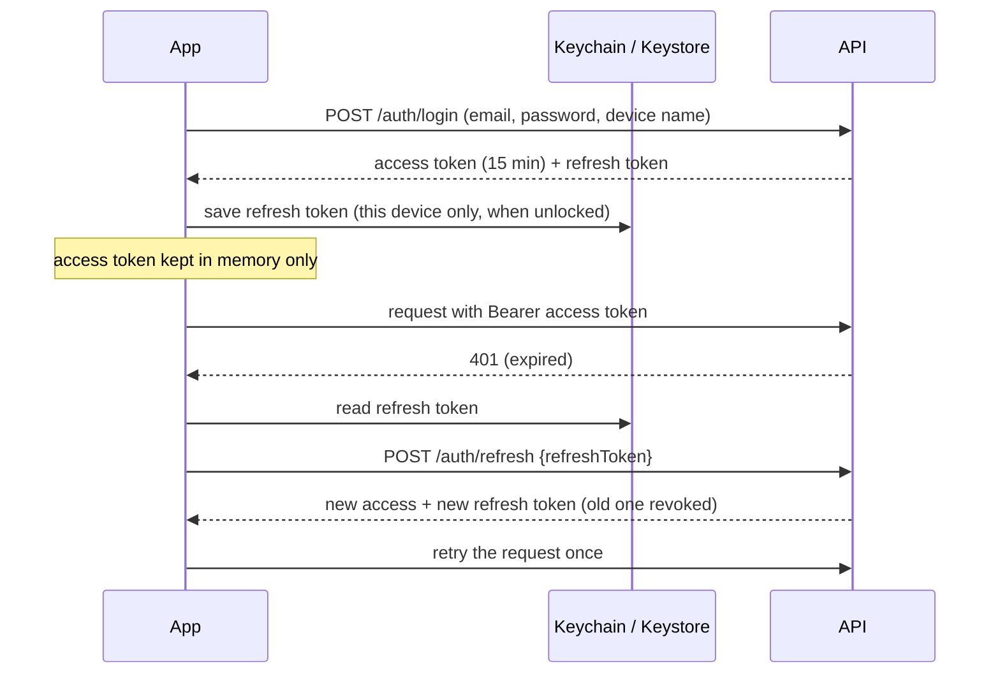
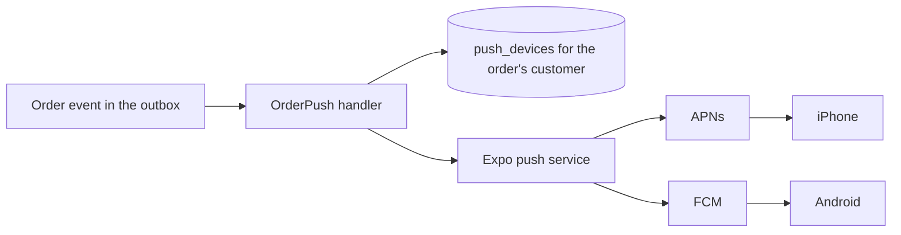

# Mobile app architecture

`apps/mobile` is an Expo (React Native) app for iOS and Android. It calls the NIXZORA API
directly over HTTPS with bearer tokens; it shares types with the API through
`@nixzora/validation` and uses the typed `@nixzora/api-client`.

## Screens and links

Routes mirror the storefront, so a storefront link opens the same screen in the app
(universal links on iOS, App Links on Android, and `nixzora://` everywhere).

| Route              | Screen                                                                     |
| ------------------ | -------------------------------------------------------------------------- |
| `/`                | Shop: search shortcut, scan shortcut, departments, new arrivals            |
| `/search?q=`       | Search as you type, sort, endless list                                     |
| `/scan`            | Camera barcode/QR scanner and manual code entry                            |
| `/cart`            | Cart lines, quantities, promo code, totals                                 |
| `/account`         | Sign in / register, orders, saved products, notifications, biometric lock  |
| `/c/[slug]`        | Department listing with sub-departments                                    |
| `/p/[slug]`        | Product: gallery, variants, stock, add to cart, save, share, specs         |
| `/checkout`        | Email, saved or new address, live tax, pay with PaymentSheet               |
| `/orders`          | Order history (signed in)                                                  |
| `/orders/[number]` | Status timeline, tracking, items, totals (`?token=` works for guest links) |
| `/wishlist`        | Saved for later                                                            |
| `/delete-account`  | Self-service account deletion                                              |

Links to pages that exist only on the web (password reset, email verification) are mapped to
the Account tab by `src/app/+native-intent.tsx`.

## Sign-in and tokens

- One refresh runs at a time (`session.refresh` and the client's single-flight): reusing a
  rotated refresh token is treated as theft by the API and ends the session.
- With the biometric lock on, the app asks for Face ID / fingerprint at launch before it
  touches the saved refresh token.
- Offline at launch: the saved sign-in is kept and the app browses as a guest until the
  network is back. A rejected refresh token signs the app out.
- Guest carts: the API hands out a cart id, stored in the keychain; at sign-in it is merged
  into the account cart (`POST /cart/merge`).

## Checkout and payment

1. `POST /checkout` creates the order, holds stock for 15 minutes and returns a payment
   session (Stripe PaymentIntent client secret and publishable key).
2. The app opens Stripe's PaymentSheet: saved cards, Apple Pay, Google Pay, and 3-D Secure
   (bank pages return through `nixzora://stripe-redirect`).
3. The order is marked paid only by the Stripe webhook; the app polls the order for a few
   seconds and shows the confirmation. If the sheet is closed or a card is declined, the
   order waits for payment and "Pay now" asks the API for a fresh payment session.

With `PAYMENTS_PROVIDER=fake` (development), a "Test payment" dialog replaces the sheet.

## Push notifications

- The app registers its Expo push token with `PUT /me/devices` after sign-in (no prompt) and
  asks for permission at a meaningful moment: after the first order, or from Account.
- Events: order confirmed, shipped, delivered, cancelled, refunded, return approved/rejected.
  Each push carries `{ path: "/orders/NX-..." }`; tapping it opens that order.
- Tokens that Expo reports as `DeviceNotRegistered` are deleted. Sign-out removes the token
  first. Guest orders have no devices and keep receiving email only.
- Push is best-effort: a failed push is logged and never makes the outbox retry the email.

## Offline

TanStack Query persists only `catalog` queries (categories, listings, product pages) to
AsyncStorage for up to 7 days. Without a connection the app shows those pages and a floating
"Offline" notice; cart and checkout explain that they need a connection. Carts, orders and
account data are never written to disk.

## Barcode scanning

The camera reads EAN-13, EAN-8, UPC-A, UPC-E and QR codes. NIXZORA product links in QR codes
open directly; barcodes and SKUs go to `GET /catalog/lookup?code=`, which matches
`product_variants.barcode` (trying both the 12-digit UPC and 13-digit EAN spellings) or the
SKU. Barcodes are validated with the GS1 check digit when staff enter them in the Ops Center.

## Build variants

| Variant     | Bundle id / package        | Scheme                | Use                                 |
| ----------- | -------------------------- | --------------------- | ----------------------------------- |
| development | `com.nixzora.shop.dev`     | `nixzora-development` | Dev client against a laptop's API   |
| preview     | `com.nixzora.shop.preview` | `nixzora-preview`     | TestFlight / Play internal, staging |
| production  | `com.nixzora.shop`         | `nixzora`             | Store release                       |

All three can be installed side by side. `app.config.ts` reads `APP_VARIANT`, `APP_LINK_DOMAIN`,
`APPLE_MERCHANT_ID` and `EAS_PROJECT_ID`; the API and web URLs come from
`EXPO_PUBLIC_API_URL` / `EXPO_PUBLIC_WEB_URL` (EAS environment variables per profile).

## Tests

- `pnpm --filter @nixzora/mobile test`: session and token rotation, scanner rules, formatting,
  components, and the scan screen with the real router (`expo-router/testing-library`).
- `pnpm --filter @nixzora/api-client test`: refresh single-flight, guest cart header, errors.
- API e2e `test/mobile.e2e-spec.ts`: barcode lookup, push devices and order pushes, account
  deletion.
- CI bundles the JavaScript for iOS and Android (Metro + Hermes) on every push.
