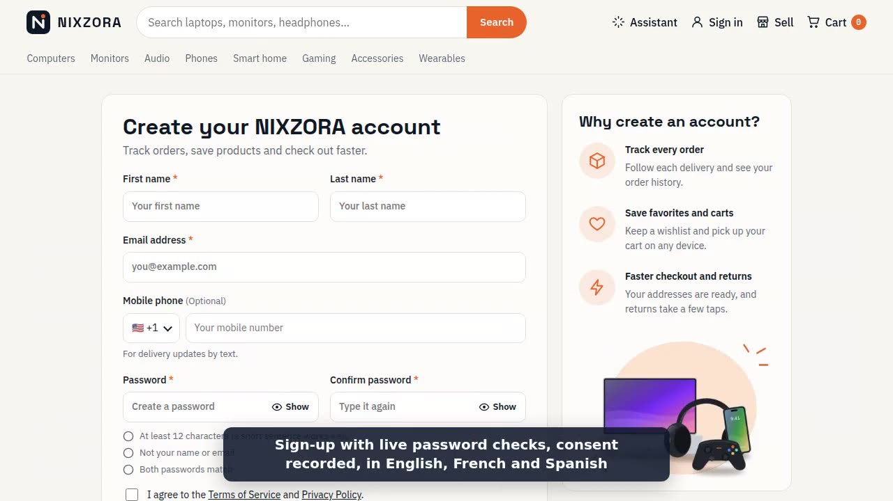
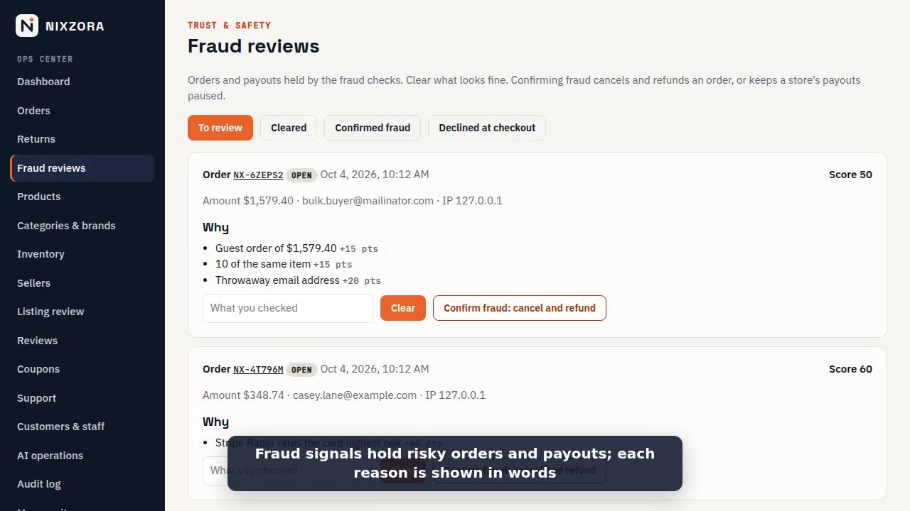
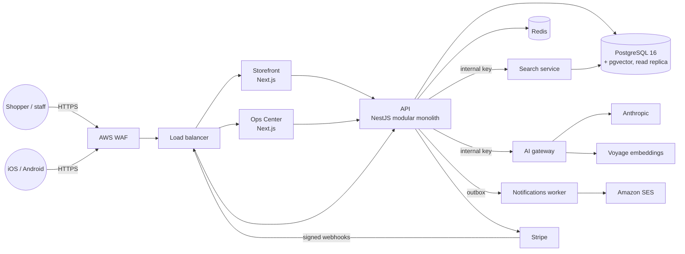

# Case study: building NIXZORA

NIXZORA is an AI-native marketplace for computers and electronics. Shoppers describe what they
need in their own words; the assistant finds real products in the catalog, explains the trade-offs
and builds the cart. Independent stores sell next to NIXZORA's own catalog, and staff run it all
from the Ops Center. It was built in public, phase by phase, as one monorepo: web storefront, iOS
and Android app, API, background services, Ops Center and the AWS infrastructure.

**Demo video (74 s):** record it locally with [`tools/demo-video/record.mjs`](#recording-the-demo)
· **Staging:** <https://staging.nixzora.com> · **Source:** this repository.

|              |         |
| --------------------------------------------- | ------------------------------------------------------ |
| The storefront: departments, deals and picks  | "A quiet laptop for coding under $1,500", answered     |
|             |          |
| Sign-up with live password checks and consent | Ops Center: orders held by fraud signals, with reasons |

## The problem

Buying electronics online means filters built for people who already know the specs. Most
shoppers know the job instead: "quiet, for coding, under $1,500", "headphones that don't hurt with
glasses". Chat assistants bolted onto stores answer that well but invent products, prices and
stock. The goal was a store where:

1. a shopper can ask in plain words and every answer is **grounded**: a live product, at the real
   price, in stock;
2. the commerce underneath is real: carts, tax, stock that never oversells, Stripe payments,
   returns, refunds, sellers and payouts;
3. it can be operated safely: roles, two-step verification, an audit log, fraud signals, alerts,
   runbooks and restore drills.

## What was built

| Area        | Highlights                                                                                                                 |
| ----------- | -------------------------------------------------------------------------------------------------------------------------- |
| Shopping    | Natural-language assistant with follow-ups, semantic and keyword search, recommendations, reviews with insights            |
| Checkout    | Server-priced carts, 15-minute stock holds, US tax and shipping, coupons, Stripe Payment Element and PaymentSheet          |
| Accounts    | Argon2id passwords, EdDSA sessions with rotating refresh tokens, TOTP, passkeys, Face ID, Google and Apple sign-in         |
| Marketplace | Six-step seller onboarding, listing review, commission ledger, Stripe Connect payouts                                      |
| Operations  | Ops Center: orders, returns, refunds, labels, catalog, people, fraud reviews, audit log; all behind roles and 2-step       |
| Mobile      | Expo app for iOS and Android: shop, scan barcodes, pay with Apple Pay / Google Pay, push updates, offline catalog          |
| Languages   | English, French and Spanish across web, app, emails and errors                                                             |
| Platform    | Terraform on AWS (ECS Fargate, RDS, ElastiCache, S3/CloudFront, WAF, SES), optional EKS/Helm and Kafka, Prometheus/Grafana |

## Architecture

A modular monolith (the NestJS API) owns every business rule; the web apps and the mobile app are
clients of it. Two pieces were split out once they had a reason to be: search (its own scaling and
index) and the AI gateway (one place for model keys, budgets and fallbacks).



More: [deployment](architecture/deployment.md) · [data model](architecture/erd.md) ·
[checkout flow](architecture/checkout-flow.md) · [auth flows](architecture/auth-flows.md) ·
[mobile](architecture/mobile.md).

## Key decisions

Every significant choice has an architecture decision record. The ones that shaped the project
most:

| Decision                                                                                     | Why it mattered                                                                              |
| -------------------------------------------------------------------------------------------- | -------------------------------------------------------------------------------------------- |
| [0001 Modular monolith first](adr/0001-modular-monolith-first.md)                            | One deploy, one database transaction for checkout; modules with clear borders to split later |
| [0003 Payments behind an interface](adr/0003-payments-provider-interface.md)                 | A fake provider makes every test, demo and load test run without Stripe; Stripe is a swap    |
| [0006 Cart and checkout](adr/0006-cart-and-checkout.md)                                      | Row-locked stock holds and an outbox: no overselling, no lost receipt emails                 |
| [0009 AI layer on pgvector](adr/0009-ai-layer-and-semantic-search.md)                        | Search and the assistant read the same catalog; picks are checked against the database       |
| [0013 Earnings ledger](adr/0013-marketplace-orders-and-earnings.md)                          | Append-only money entries: payouts, refunds and commission always add up                     |
| [0015 Search service](adr/0015-search-service.md), [0016 AI service](adr/0016-ai-service.md) | Split out only when scaling and key handling gave a reason                                   |
| [0020 Kafka from the outbox](adr/0020-event-streaming-kafka.md)                              | Event streaming without dual writes: the database stays the source of truth                  |
| [0023 SLOs and burn-rate alerts](adr/0023-prometheus-grafana-slos.md)                        | Alerts on what shoppers feel, with an error-budget policy                                    |
| [0024 Fraud signals](adr/0024-fraud-signals.md)                                              | Explainable rules first (shadow mode to tune), holds instead of silent declines              |

All 24: [docs/adr](adr/).

## Quality, in numbers

| Measure              | Result                                                                                                                       |
| -------------------- | ---------------------------------------------------------------------------------------------------------------------------- |
| Code                 | ~78k lines of TypeScript; 23 API modules, 46 data models, 26 migrations                                                      |
| Tests                | ~416 unit tests in 72 files; 188 API end-to-end tests on a real database; 12 browser tests                                   |
| Shopping assistant   | 16/16 evaluation conversations pass, **0 ungrounded picks**, gated in CI ([report](evaluation/assistant.md))                 |
| Load (expected peak) | 9,558 requests, **0 failed**; pages p95 under 50 ms, API p99 under 60 ms ([report](performance/load-test-report-2026-10.md)) |
| Load (10× peak)      | Still 0 failed; API p99 under 330 ms against a 1 s SLO                                                                       |
| Security             | 16 security regression tests, CSP/HSTS checks, CodeQL, OWASP ZAP scans ([checklist](security/pentest-checklist.md))          |
| Operations           | 12 runbooks, 3 SLOs with burn-rate alerts, a scripted restore drill                                                          |

CI runs lint, types, unit, API end-to-end, browser, assistant evaluation, Terraform tests,
shellcheck and CodeQL on every push; every green push to `main` deploys to staging.

## Things that were harder than expected

- **Grounding is a database check, not a prompt.** Asking the model to "only use catalog
  products" was not enough. Every pick is now looked up again after generation; a pick that is not
  a live product at the shown price fails the evaluation, and CI fails with it.
- **The slow page was a formatter.** Load testing found the home page's tail at seconds under
  heavy load. Profiling showed `Intl.NumberFormat` created for every price on every render;
  caching it cut the median under load from 2.06 s to 67 ms.
- **Concurrency bugs hide in business rules.** Two checkouts using the same single-use coupon,
  two payout runs for one store, the last unit bought twice: each now has a test that fires the
  requests at the same moment.
- **Content Security Policy found a library.** Turning on a strict CSP showed Zod probing `eval`
  in the browser; it now runs in its JIT-less mode there.
- **Infrastructure tests need known values.** Terraform's mocked plans leave computed attributes
  unknown, so tests assert on what the configuration decides, not on what AWS would return.
- **Fraud rules must not punish normal people.** A shopper retrying a declined card twice is
  normal; ten cards from one IP is not. Rules started in shadow mode to see who they would have
  stopped.

## Security and reliability

- Threat model ([threat-model.md](security/threat-model.md)) reviewed each phase, mapped to an
  OWASP ASVS level 2 [pen-test checklist](security/pentest-checklist.md) with the test behind
  each item.
- Staff routes need a role **and** two-step verification; every privileged action lands in an
  append-only audit log.
- Card data never reaches NIXZORA (Stripe Elements / PaymentSheet); webhooks are signed and
  idempotent.
- Recovery: 5-minute point-in-time recovery, daily AWS Backup, versioned media, and a
  [restore drill](runbooks/disaster-recovery.md) that restores to a temporary instance and runs
  the release's own verification against it.

## Recording the demo

The video is filmed by a script, so it can be re-recorded after any UI change:

```sh
pnpm build                                # API, storefront, Ops Center
pnpm --filter @nixzora/api db:seed        # demo catalog
# start the API with PAYMENTS_PROVIDER=fake, the storefront on :3000 and the Ops Center on :3001
STAFF_EMAIL=… STAFF_PASSWORD=… STAFF_TOTP_SECRET=… node tools/demo-video/record.mjs
# → tools/demo-video/out/nixzora-demo.mp4 (needs ffmpeg; not committed)
```

It films a shopper asking the assistant, refining the request, adding a pick and paying (test
mode), then sign-up and the seller page, then the Ops Center: orders, fraud reviews and the audit
log. Captions are drawn on the page; the staff sign-in with two-step verification happens off
camera. Without the `STAFF_*` variables only the shopping part is filmed.

## What's next

- Live Stripe test payments on staging end to end (keys and webhook in place), then SES
  production access for real email.
- An external penetration test before real money; CSP nonces; image re-encoding and malware
  scanning for uploads.
- A second-region backup copy once production carries revenue.
- Evaluate the assistant with the paid model drivers on a larger, real-shopper question set.
