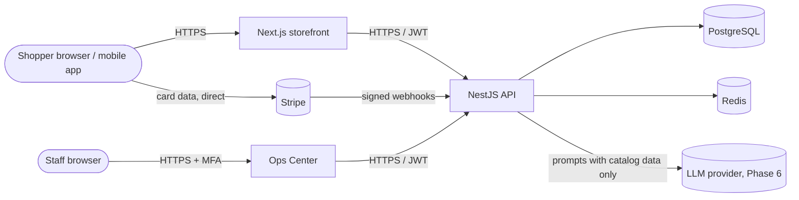

# NIXZORA threat model — v6 (Phase 6)

Method: STRIDE per component. This version covers the Phase 0–6 scope (web storefront, mobile app, Ops Center, API, PostgreSQL, Redis, Stripe, AWS, and the AI layer: search index, shopping assistant, model providers). It is reviewed and updated at the end of every phase.

## System and trust boundaries

Trust boundaries: the public internet ↔ web/API; API ↔ data stores (private network only); API ↔ third parties (Stripe, LLM, email).

## Assets

Customer accounts and sessions · personal data (names, addresses, emails) · order and payment records · staff accounts and permissions · audit history · catalog and pricing integrity · signing keys and secrets.

## STRIDE analysis

| Threat                     | Example                                                   | Mitigation                                                                                                              | Phase    |
| -------------------------- | --------------------------------------------------------- | ----------------------------------------------------------------------------------------------------------------------- | -------- |
| **S**poofing               | Credential stuffing against sign-in                       | Rate limiting per IP and account, breached-password check, Argon2id, optional MFA for customers, required MFA for staff | P1 ✔     |
| Spoofing                   | Forged Stripe webhook marks an order paid                 | Verify Stripe signature; idempotency table; amount and currency re-checked against the order                            | P3       |
| **T**ampering              | Client changes the price in a checkout request            | Prices always re-read on the server from `product_variants`; client totals are ignored                                  | P3       |
| Tampering                  | Admin edits or deletes audit history                      | `audit_logs` append-only trigger; separate DB role without DDL rights in production                                     | P0 ✔, P4 |
| **R**epudiation            | Staff member denies issuing a refund                      | Every privileged action writes actor, IP, user agent and entity to `audit_logs` (auth events done)                      | P1 ✔, P4 |
| **I**nformation disclosure | Tokens or cookies in logs                                 | Pino redaction of `authorization`, `cookie`, `set-cookie` headers                                                       | P0 ✔     |
| Information disclosure     | Card data exposure                                        | Card data never reaches NIXZORA (Stripe Elements / SDK)                                                                 | P3       |
| Information disclosure     | Customer A reads customer B's order (IDOR)                | Ownership checks in every query; non-guessable UUIDv7 ids are not relied on for access control                          | P3       |
| Information disclosure     | Secrets committed to the public repo                      | `.env` git-ignored, `.env.example` only; secret scanning on GitHub; AWS Secrets Manager in P4                           | P0 ✔, P4 |
| **D**enial of service      | Request floods                                            | Global throttling (120 req/min per client today), WAF and bot control on CloudFront in P4                               | P0 ✔, P4 |
| Denial of service          | Expensive AI requests drain budget                        | Per-user and per-request cost caps, cached answers, queueing                                                            | P6       |
| **E**levation of privilege | Customer calls an admin endpoint                          | Permission-based guards on every admin route; deny by default                                                           | P1 ✔     |
| Elevation of privilege     | Prompt injection makes the AI agent act outside its tools | Agent can only call whitelisted, permission-checked tools; answers grounded in catalog data                             | P6       |
| Supply chain               | Malicious or vulnerable dependency                        | Lockfile, `pnpm audit` in CI, Dependabot, install scripts allow-listed in `pnpm-workspace.yaml`                         | P0 ✔     |

## Security controls already in place (Phase 0)

- Helmet security headers on the API; security headers and no `X-Powered-By` on the storefront.
- Strict environment validation at API startup.
- CORS restricted to configured origins.
- Global rate limiting.
- Log redaction of credentials.
- Append-only audit log enforced in PostgreSQL.
- CI with dependency audit and Dependabot.

## Phase 1 additions

| Threat                                          | Mitigation                                                                                      | Status   |
| ----------------------------------------------- | ----------------------------------------------------------------------------------------------- | -------- |
| Stolen refresh token replayed                   | Rotation on every use; replay of the previous token revokes the session and is audited          | ✔        |
| Stolen access token used after sign-out         | Session checked in the database on every request                                                | ✔        |
| TOTP code replayed within its 30 s window       | Each time step accepted once per user (Redis)                                                   | ✔        |
| Database leak exposes MFA secrets or tokens     | TOTP secrets AES-256-GCM encrypted; refresh, email and recovery tokens stored as SHA-256 hashes | ✔        |
| Account discovery through password reset        | Same 202 response for known and unknown emails                                                  | ✔        |
| Account discovery through sign-up               | Accepted risk: 409 on duplicates, limited to 5/min per IP; owner is emailed                     | Accepted |
| Lockout abused to block a customer              | Temporary (15 min); password reset clears it                                                    | Accepted |
| Weak signing keys or missing keys in production | Ed25519 keys and MFA key required in production; API refuses to start without them              | ✔        |

## Phase 2 additions

| Threat                                                  | Mitigation                                                                                                                       | Status |
| ------------------------------------------------------- | -------------------------------------------------------------------------------------------------------------------------------- | ------ |
| Malicious file uploaded as a product image              | Allow-listed types only; magic bytes checked against the declared type; 10 MB cap; served with `nosniff` and a fixed type        | ✔      |
| Upload link reused or used to overwrite another file    | HMAC-signed, 5-minute links for one server-chosen key; files written with exclusive create (`wx`), so a link works once          | ✔      |
| Path traversal through image URLs                       | Storage keys must match `products/YYYY/MM/<uuid>.<ext>`; anything else is a 404                                                  | ✔      |
| Two checkouts buy the last unit (overselling)           | Stock rows locked with `SELECT … FOR UPDATE` in sorted order inside one transaction; covered by a concurrency test               | ✔      |
| Abandoned checkouts hold stock forever                  | Holds expire after 15 minutes; a sweeper releases them (Redis lock so only one instance sweeps)                                  | ✔      |
| Staff session stolen from the browser                   | Ops Center keeps tokens in HttpOnly, SameSite=Lax cookies; only its server calls the API; `noindex` and `frame-ancestors` denial | ✔      |
| Cross-site request forges a staff action                | Next.js server actions check the Origin header; cookies are SameSite=Lax                                                         | ✔      |
| Tampered form field points an Ops Center call elsewhere | Ids are validated as UUIDs and role keys against an allow-list before they are put in an API path                                | ✔      |
| Admin locks everyone out                                | Admins cannot remove their own admin role or suspend themselves; suspending revokes all of that user's sessions                  | ✔      |
| Staff action denied later                               | Catalog, inventory, role and status changes are audited with actor, IP and before/after values                                   | ✔      |

## Phase 3 additions

| Threat                                         | Mitigation                                                                                                    | Status |
| ---------------------------------------------- | ------------------------------------------------------------------------------------------------------------- | ------ |
| Client changes prices or totals                | Carts hold quantities only; totals recomputed on the server at checkout and charged from the order row        | ✔      |
| Forged or replayed payment webhook             | Stripe signature verified on the raw body; event ids stored in the same transaction as the change             | ✔      |
| Charged twice after a retried checkout request | Payment intent idempotency key = order id                                                                     | ✔      |
| Paid amount differs from the order             | Amount and currency compared on every success event; mismatches logged loudly                                 | ✔      |
| Guest order pages enumerated (IDOR)            | Orders need a 256-bit HMAC link token or the owner's session; numbers alone reveal nothing                    | ✔      |
| Guest cart ids guessed                         | 256-bit random ids, format-checked, in HttpOnly cookies                                                       | ✔      |
| Test payments used in production               | API refuses to start in production unless `PAYMENTS_PROVIDER=stripe`; the fake endpoint is disabled otherwise | ✔      |
| Card data exposure                             | Stripe Payment Element iframe; card data never reaches NIXZORA servers or logs                                | ✔      |
| Open redirect after sign-in (`?next=`)         | Only same-site paths are accepted                                                                             | ✔      |
| Refresh-token race revokes customers' sessions | The web servers share one refresh call per token for concurrent requests                                      | ✔      |
| Staff ship or cancel the same order twice      | Conditional status updates; refunds issued before any local change                                            | ✔      |
| Abandoned checkouts lock stock                 | 15-minute holds, renewed only while paying; unpaid orders cancelled after 24 h                                | ✔      |

## Phase 4 additions

| Threat                                        | Mitigation                                                                                               | Status |
| --------------------------------------------- | -------------------------------------------------------------------------------------------------------- | ------ |
| Refunding more than was paid, or twice        | Refunds capped at total − refunded; provider refund first; optimistic check on `refunded_cents`          | ✔      |
| Fraudulent returns                            | Only delivered orders, 30-day window, quantities capped at what was bought; staff approve and receive    | ✔      |
| Coupon abuse (reuse past the limit, races)    | Redemption counted atomically in the order transaction; released only for orders that were never paid    | ✔      |
| Fake or abusive reviews                       | One per customer per product, moderation before publishing, verified-purchase flag, 10 submissions/hour  | ✔      |
| Reviewer privacy                              | Public reviews show first name and initial only; emails visible to moderators only                       | ✔      |
| Forged carrier tracking updates               | EasyPost HMAC signature verified; duplicate events ignored                                               | ✔      |
| Label links guessed                           | Test labels need an HMAC signature; real labels are EasyPost-hosted and shown to staff only              | ✔      |
| Staff notes leaking to customers              | Separate permission (`customers.notes`); never included in customer-facing responses                     | ✔      |
| Long-lived cloud credentials in CI            | GitHub OIDC role limited to `main` and protected environments; least-privilege deploy permissions        | ✔      |
| Database or cache reachable from the internet | Private subnets; security groups allow only app tasks; TLS enforced (RDS `force_ssl`, Redis transit TLS) | ✔      |
| Secrets in Terraform state or images          | App keys set with the CLI into Secrets Manager; RDS manages its own password; images contain no secrets  | ✔      |
| Layer-7 floods and common web attacks         | AWS WAF managed rules, IP reputation list, per-IP rate limits (tighter on sign-in and checkout)          | ✔      |
| Data loss                                     | PITR, daily AWS Backup (35 d), monthly (1 y) in production, versioned media bucket, deletion protection  | ✔      |

## Phase 5 additions (mobile app)

| Threat                                              | Mitigation                                                                                                               | Status |
| --------------------------------------------------- | ------------------------------------------------------------------------------------------------------------------------ | ------ |
| Refresh token stolen from a lost or backed-up phone | Stored in Keychain/Keystore, readable only when unlocked, this device only (not in backups); access token in memory only | ✔      |
| Someone using an unlocked, borrowed phone           | Optional Face ID / fingerprint lock before the saved sign-in is used; account deletion re-asks the password              | ✔      |
| Refresh token replay from the app                   | Single-flight rotation in the app; reuse of a rotated token revokes the whole session family (API)                       | ✔      |
| Card data on the device or our servers              | Stripe PaymentSheet collects cards, Apple Pay and Google Pay; the app only sees a client secret                          | ✔      |
| Client marks an order paid                          | Orders change to paid only from the signed Stripe webhook; the app just reads the order                                  | ✔      |
| Push notifications to the wrong person              | Tokens bound to the signed-in account, moved on re-registration, removed at sign-out and on `DeviceNotRegistered`        | ✔      |
| Sensitive data in push payloads or on lock screen   | Pushes contain the order number and a status only; no prices, addresses or links with tokens                             | ✔      |
| Link hijacking (another app claims our links)       | Verified universal links / App Links (`.well-known` files with team id and certificate fingerprints)                     | ✔      |
| Malicious deep links                                | Links map only to read-only screens; unknown paths show "not found"; web-only account links open Account                 | ✔      |
| Account data left in the offline cache              | Only public catalog queries are persisted; cart, orders and account data stay in memory                                  | ✔      |
| Malicious QR codes                                  | Only NIXZORA product links, barcodes and SKUs are acted on; other content is ignored, never opened                       | ✔      |
| Barcode lookup used to enumerate the catalog        | Public data only, active products only, behind the global rate limit                                                     | ✔      |
| Right to erasure / store policy                     | `DELETE /me`: password check, personal data erased, sessions and devices revoked, orders kept anonymised                 | ✔      |
| Leaking store credentials or signing keys           | Native projects generated (not stored); keystores, APNs keys and service accounts live in EAS, never in git              | ✔      |

## Phase 6 additions (AI layer)

| Threat                                                         | Mitigation                                                                                                                                          | Status |
| -------------------------------------------------------------- | --------------------------------------------------------------------------------------------------------------------------------------------------- | ------ |
| Prompt injection in a shopper message ("ignore instructions…") | The model has no tools that act: it only fills a typed search form and writes text; conversation and catalog text are sent as data inside tags      | ✔      |
| Model invents a product, price or stock state                  | Products, prices, stock and the comparison come from the database; model text may only cite `[n]` picks and their exact prices, else it is replaced | ✔      |
| Prompt injection planted in product data (seller text, P7)     | Catalog text is passed as data, never as instructions; the model's output is grounded and has no actions; review before sellers can edit text       | ◐      |
| Assistant adds items without consent                           | It only suggests; "Add to cart" is the shopper's click on the normal cart API                                                                       | ✔      |
| Cost abuse (denial of wallet) on paid models                   | 20 requests/min per shopper IP, short max_tokens, daily spend cap (`AI_DAILY_BUDGET_CENTS`) after which the free local driver answers               | ✔      |
| Provider outage or slow model                                  | 20 s timeouts; any model error falls back to the local driver; semantic search failure falls back to keyword search                                 | ✔      |
| Model provider keys leaked                                     | Separate Secrets Manager secret, injected only into the API task; never in images, logs or the client                                               | ✔      |
| Shopper data sent to model providers                           | Only the conversation text is sent, no account, address or order data; providers do not train on API data by default                                | ✔      |
| All shoppers sharing one rate-limit bucket behind the web apps | The storefront and Ops Center relay the shopper IP with an internal key (Terraform-generated); the API trusts one proxy hop (the ALB)               | ✔      |
| Evaluation drift: a change silently degrades recommendations   | 16-case evaluation set in CI with a 90% bar and zero tolerance for ungrounded picks                                                                 | ✔      |

## Sign in with Google / Apple

| Threat                                                       | Mitigation                                                                                                                         | Status |
| ------------------------------------------------------------ | ---------------------------------------------------------------------------------------------------------------------------------- | ------ |
| Forged or foreign ID token (made for another app)            | Signature checked against Google's / Apple's published keys; issuer and audience must be ours; tokens over an hour old are refused | ✔      |
| Token replay (a token captured elsewhere is presented to us) | One-time nonce in an HttpOnly cookie (web) or generated per attempt (app) must match the token's nonce                             | ✔      |
| Account takeover by linking an unverified email              | Linking to an existing account by email only when the provider says the email is verified; otherwise refused                       | ✔      |
| Social sign-in bypassing two-step verification               | Accounts with MFA get the same code challenge after Google / Apple                                                                 | ✔      |
| Provider secrets leaked                                      | None exist: no code exchange, only public client ids                                                                               | ✔      |
| Account with no password cannot be closed                    | Google/Apple-only accounts confirm deletion by typing DELETE; linked identities are erased                                         | ✔      |

## Recommendations and view events (ADR-0010)

| Threat                                                  | Mitigation                                                                            | Status |
| ------------------------------------------------------- | ------------------------------------------------------------------------------------- | ------ |
| "Customers also viewed" reveals one shopper's browsing  | A product is only listed when at least 2 different shoppers viewed both               | ✔      |
| Tracking guests across sites or devices                 | Guest id is random per browser/app, HttpOnly on the web, never an IP, device or ad id | ✔      |
| Reading someone else's history by guessing a visitor id | 18+ random bytes; ids that fail the format are ignored                                | ✔      |
| Event spam skews popularity                             | 60 views/min per client, one view per shopper per product per 30 min                  | ✔      |
| Keeping behavior data forever                           | Deleted after 180 days and on account deletion                                        | ✔      |

## Review insights and copy suggestions (ADR-0011)

| Threat                                                    | Mitigation                                                                                         | Status |
| --------------------------------------------------------- | -------------------------------------------------------------------------------------------------- | ------ |
| Model invents a statistic in the review summary           | Counts come from code; any number not computed by us rejects the model text                        | ✔      |
| Prompt injection inside a review ("ignore instructions…") | Reviews are sent as data; the model has no tools; output is checked and only replaces one sentence | ✔      |
| Model-written product copy claims specs the product lacks | Draft only, never auto-saved; numbers must appear in the facts; staff review before saving         | ✔      |
| Summaries look like genuine reviews from real people      | Labelled "AI summary" / "Summary of N reviews"; demo reviewers are named "(demo)"                  | ✔      |
| Cost runaway from regenerating summaries                  | Hash of reviews + model skips unchanged products; daily budget falls back to templates             | ✔      |

## Marketplace sellers (ADR-0012)

| Threat                                            | Mitigation                                                                                          | Status |
| ------------------------------------------------- | --------------------------------------------------------------------------------------------------- | ------ |
| Seller edits or reads another store's listings    | Every seller route resolves the caller's store; other stores' products and variants read as 404     | ✔      |
| Seller publishes without review                   | Status is not writable by sellers; only staff approve; content edits on live listings re-review     | ✔      |
| Fraudulent seller receives payouts                | Stripe Connect verifies identity and bank; stores are approved only after verification; payout hold | ✔      |
| NIXZORA leaks sellers' bank or ID documents       | Never received: Stripe-hosted onboarding; only the account id and verification flags are stored     | ✔      |
| Suspended store keeps selling                     | Suspension unpublishes live and pending listings in the same transaction; writes are refused        | ✔      |
| Store name impersonates NIXZORA or support        | Reserved handles and any handle containing "nixzora" are refused                                    | ✔      |
| Malicious or counterfeit listing reaches shoppers | Manual review queue with photos, specs and prices; staff notes; audit trail of every decision       | ✔      |
| Test payouts enabled in production                | Environment validation refuses PAYOUTS_PROVIDER=fake in production unless the demo flag is set      | ✔      |

## Marketplace orders and earnings (ADR-0013)

| Threat                                                 | Mitigation                                                                                      | Status |
| ------------------------------------------------------ | ----------------------------------------------------------------------------------------------- | ------ |
| Seller sees customer contact details                   | Seller views include the ship-to name and address only; no email or phone                       | ✔      |
| Seller ships or reads another store's order            | Every seller-order route is scoped to the caller's store; others read as 404                    | ✔      |
| Seller marks an order shipped with a fake tracking no. | Earnings are held 14 days after shipping; refunds are debited from the seller; audit trail      | ◐      |
| Commission changed after the sale                      | The rate is frozen on the seller order when the payment succeeds                                | ✔      |
| Earnings counted twice (retried webhook or request)    | Ledger entries carry unique idempotency keys (one sale per part, one debit per refund and part) | ✔      |
| Refund of NIXZORA's items charged to a seller          | Refunds follow the returned lines, or each party's share of the items, capped per part          | ✔      |
| Cancelling an order a seller already shipped           | Refused: the order must be refunded instead                                                     | ✔      |

## Seller payouts (ADR-0014)

| Threat                                           | Mitigation                                                                                       | Status |
| ------------------------------------------------ | ------------------------------------------------------------------------------------------------ | ------ |
| The same balance paid twice (retries, two tasks) | Balance debited first under a per-seller lock; one pending payout per store; idempotent transfer | ✔      |
| Money lost when a transfer fails                 | Failed payouts credit the amount back to the balance and keep the provider's reason              | ✔      |
| Staff member pays out to themselves              | Payouts only go to the store's verified connected account; staff action needs MFA and is audited | ✔      |
| Seller withdraws before a refund or chargeback   | Earnings held 14 days after shipping (adjustable per store); negative balances net later sales   | ✔      |

## Open items

- Content Security Policy for the storefront allowing only Stripe's script and frames (P6).
- Data retention policy for personal data in orders (account deletion is done in the API and app; add it to the web account page) (P6).
- Image re-encoding (strip EXIF, resize) in a background worker, and malware scanning of uploads in S3 (P6).
- Content Security Policy for the Ops Center (P6).
- Stripe Connect `account.updated` webhook so verification changes arrive without a refresh (p7-06).
- Seller staff invitations (STAFF members) with their own audit trail (P7).
- Verify seller tracking numbers with carrier webhooks before releasing earnings (P8).
